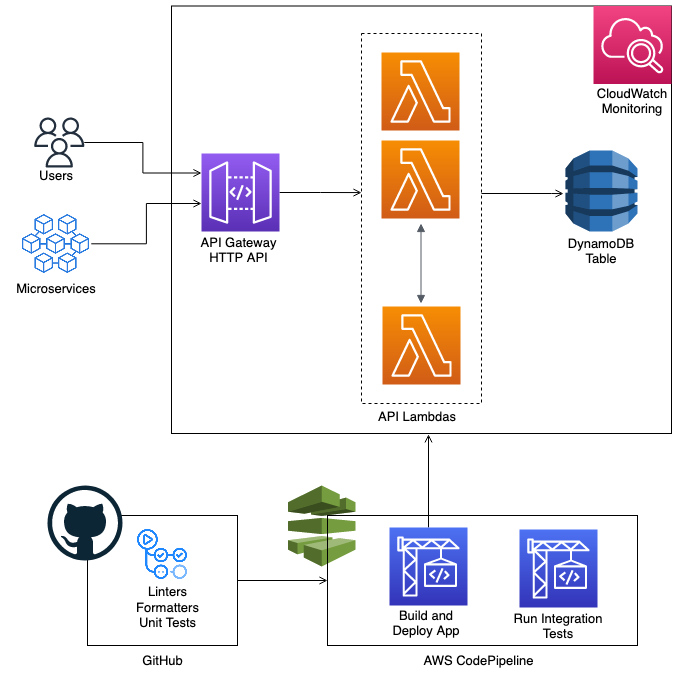

# Python-APIGateway-DynamoDB

This is a serverless API microservice developed using the [AWS CDK](https://aws.amazon.com/cdk/) and structured following [best practices](https://docs.aws.amazon.com/cdk/v2/guide/best-practices.html).

The application is organized into logical units, such as API, database, monitoring resources and deployment pipeline. These logical units should be implemented as [constructs](https://docs.aws.amazon.com/cdk/v2/guide/constructs.html), including the infrastructure and the runtime code. The constructs are later group in [stacks](https://docs.aws.amazon.com/cdk/v2/guide/stacks.html), which define the deployment models.

The runtime code is written in Python and defines basic CRUD operations to manage music albums as an example.

In this project you can also find how to apply linting and formatting rules to your code. Implement continuos integration using [GitHub Actions](https://docs.github.com/en/actions) and continuos deployment using [CodePipeline](https://docs.aws.amazon.com/codepipeline/latest/userguide/welcome.html). 

### Architecture

This is a simple service that uses [AWS API Gateway HTTP API](https://docs.aws.amazon.com/apigateway/latest/developerguide/http-api.html). It's integrated with Lambda functions on the backend and uses IAM authentication. A DynamoDB table is used as the database. 



### Project Structure

Each logical unit has a directory that includes the related infrastructure, runtime and configuration code. This way, any developer can easily find the code related to a specific logical unit. 

    .
    ├── .github                         # GitHub actions for continuos integration
    |
    ├──api
    |   |── cdk.ts                      # CDK construct with API resources and Lambdas
    |   |── api_resource                # Create a folder for each API resource. In this case the resource name is Item
    |   |   |── api_resource_method     # Create a folder for each API method associated with that particular resource (parent folder)           
    |   |   |   |── lambda_handler      # Code for Lambda handler
    |   |   |   |── requirements.txt    # Python packages that needs to be bundle with this Lambda      
    |   |
    |   |── ...
    |
    |──database
    |   |── cdk.ts                      # CDK construct with DynamoDB table resource
    |
    ├── monitoring
    |   |── cdk.ts                      # CDK construct with Monitoring dashboard and alarms                  
    |
    ├── pipeline                
    |   |── cdk.ts                      # CDK stack with deployment pipeline
    |
    |── tests
    |   |── integration                 # Integration tests
    |   |── unit                        # Unit tests
    |
    |── app.ts                          # Main CDK application (Constructs are imported here and deployed within Stacks)
    |
    |── other linters and formatters files (.eslintrc.yml, .flake8, .pylintrc)
    |
    └── ...

### How to deploy

You can fork this repository and clone it to your local environment.

Then, if you want to deploy the application to the development environment, please follow the next steps:

1. `npm install`
2. `npm run cdk deploy Python-Serverless-API-Stack Python-Serverless-API-Table-Stack Python-Serverless-API-Monitoring-Stack`

To deploy the application through the deployment pipeline, follow these steps:

1. Create [AWS CodeStart GitHub connection](https://docs.aws.amazon.com/codepipeline/latest/userguide/connections-github.html)
    - Create SSM parameter for the connection ARN and assign the following name `Github-Connection`
2. Modify the `app.ts` file and enter your Github user and the repo name
```typescript
new CodePipelineStack(app, 'DeploymentPipelineStack', {
  repoOwner: <github_user>,
  repoName: <repo_name>
})
```
3. `npm install`
2. `npm run cdk deploy Python-Serverless-API-Pipeline-Stack`

### How to configure Python environment for local development 

1. `python3 -m venv .venv`
2. `source .venv/bin/activate`
3. `pip install -r requirements.txt`

Run unit tests - `python -m pytest tests/unit` <br />
Run integration tests - `python -m pytest tests/integration`

### Useful commands

 * `cdk deploy`      deploy this stack to your default AWS account/region
 * `cdk diff`        compare deployed stack with current state
 * `cdk synth`       emits the synthesized CloudFormation template
